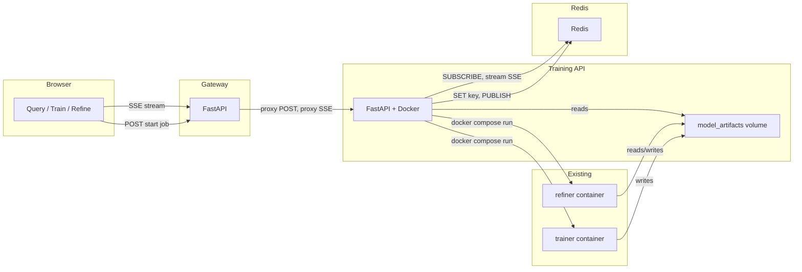

# Train and Refine GUI Pages: Technical Architecture

<!-- TASK-REF: B1..B12 = batches in TRAIN_AND_REFINE_GUI_PAGES_TASKS.md -->

Technical architecture for the Train and Refine frontend pages, training-api
service, Redis-backed job state, and event-driven completion via SSE. Intended
for implementers and integration. For product requirements see
[TRAIN_AND_REFINE_GUI_PAGES_PRD.md](../requirements/TRAIN_AND_REFINE_GUI_PAGES_PRD.md);
for planning see [TRAIN_AND_REFINE_GUI_PAGES_PLAN.md](../planning/TRAIN_AND_REFINE_GUI_PAGES_PLAN.md).

## Table of Contents

1. [Technical Goals and Constraints](#1-technical-goals-and-constraints)
2. [Component Architecture](#2-component-architecture)
3. [Event-Driven Flow](#3-event-driven-flow)
4. [Training API](#4-training-api)
5. [Gateway Proxy](#5-gateway-proxy)
6. [Frontend Technical Design](#6-frontend-technical-design)
7. [Data Contracts](#7-data-contracts)
8. [Docker Compose and Volumes](#8-docker-compose-and-volumes)
9. [Security and Robustness](#9-security-and-robustness)
10. [File and Implementation Summary](#10-file-and-implementation-summary)

## 1. Technical Goals and Constraints
<!-- Tasks: B1 B3 B4 -->

### 1.1 Goals

- **Event-driven completion:** No polling; job completion notified via Redis
  PUBLISH and SSE stream to the client. No long HTTP timeouts or sleep loops.
- **Single implementation:** Train, refine, and promote implemented once in
  Python; triggered by (1) HTTP API (UI) and (2) CLI via Docker Compose
  (scripts). No duplicated business logic.
- **Platform alignment:** Same stack as main project: Docker Compose,
  Python/FastAPI. Redis as a dedicated service in the same Compose file.

### 1.2 Current State (Pre-requisites)

- **Frontend:** Vanilla HTML/CSS/JS in `services/gateway/app/static/`; single
  page, no router; no tables today (only list-based trace timeline).
- **Train/Refine:** One-shot containers via `docker compose --profile train run
  --rm trainer` and `docker compose --profile refine run --rm refiner`. They
  read/write the **model_artifacts** volume and host-mounted `train.csv`. The
  gateway has no access to this volume (cannot read metrics, misclassified, or
  refinement outputs).
- **Trainer outputs:** `metrics.json`, `misclassified.csv` (columns: text,
  true_label, pred_label, pred_confidence, probs_json).
- **Refiner outputs:** `refinement_report.json`, `proposed_relabels.csv`,
  `proposed_examples.csv`, `train_candidate.csv`, `metrics_before.json`.
  Comparison "after" metrics require running the trainer on `train_candidate.csv`
  to produce `metrics_candidate.json` (as in `scripts/promote.sh`).

## 2. Component Architecture
<!-- Tasks: B3 B4 B5 B6 B7 -->

### 2.1 Components

| Component | Role |
| --- | --- |
| **Browser UI** | Query, Train, Refine; hash-based routing (`#`, `#train`, `#refine`) |
| **Gateway** | Proxies POST/GET to training-api; streaming proxy for SSE; no direct UI |
| **Training API** | FastAPI service; runs train/refine/promote in Python; Redis job state and Pub/Sub; reads/writes model_artifacts volume |
| **Redis** | Dedicated service; job keys (TTL); Pub/Sub channels for completion |
| **Trainer / Refiner** | Existing one-shot containers; invoked by training-api via Docker Compose |

### 2.2 Data Flow

- UI sends POST to gateway; gateway proxies to training-api. Training-api
  creates job, stores state in Redis, spawns background task, returns
  `job_id` immediately.
- Background task runs trainer/refiner via Docker Compose; on completion reads
  artifacts from model_artifacts volume, SETs Redis key, PUBLISHes to Redis
  channel.
- UI opens EventSource to gateway; gateway streams SSE from training-api. Training-api
  SUBSCRIBEs to Redis channel; on first message sends SSE event to client and
  closes stream. No polling.

### 2.3 Architecture Diagram



## 3. Event-Driven Flow
<!-- Tasks: B2 B5 B6 B8 -->

### 3.1 Redis Keys

- **Key pattern:** `job:train:{job_id}` and `job:refine:{job_id}`.
- **Value:** JSON: `{ "status", "result" (when completed), "error" (when failed),
  "created_at" }`.
- **TTL:** 24h (86400s) to limit storage.

### 3.2 Redis Pub/Sub

- **Channels:** `job:train:events:{job_id}` and `job:refine:events:{job_id}`.
- **Message:** On job completion, training-api PUBLISHes final payload (e.g.
  `{"status":"completed","result":{...}}` or `{"status":"failed","error":"..."}`).
  One message per job; client receives it once via SSE.

### 3.3 SSE Endpoints

- **Training-api:** GET `/train/events/{job_id}` and GET `/refine/events/{job_id}`.
  Each SUBSCRIBEs to the Redis channel; on first message, sends it as an SSE
  event to the client and closes the stream.
- **Gateway:** Proxies GET `/api/train/events/{job_id}` and
  GET `/api/refine/events/{job_id}` as streaming responses so that
  `EventSource` can connect to the gateway origin. No buffering; stream
  response body from training-api to client.

### 3.4 Client Flow

1. POST to start job; receive `{ "job_id": "..." }`.
2. Open `EventSource(url)` to `/api/train/events/{job_id}` (or refine).
3. Show indeterminate progress until one SSE event received.
4. On event: close EventSource, hide progress, render result or error.

## 4. Training API
<!-- Tasks: B1 B3 B4 B5 B6 B7 -->

### 4.1 Location and Modes

- **Location:** `services/training-api/`.
- **HTTP server (default CMD):** Serves FastAPI app for UI; healthcheck and
  REDIS_URL/REDIS_HOST/REDIS_PORT configuration.
- **CLI mode:** Override for `docker compose run training-api promote` (or
  `train`, `refine` subcommands). Same Python code as HTTP handlers; entrypoint
  e.g. `python -m app.cli promote`.

### 4.2 Volume and Artifacts

- **Volume layout:** Unchanged. Trainer outputs at `/model/` (same volume as
  refiner's `/data/`); training-api mounts model_artifacts at one path to read
  both. When the background task finishes, it reads artifact files and puts
  parsed result into Redis so status endpoint can return it without re-reading
  the volume.
- **Promotion:** Read-write mount of host `train.csv` at e.g.
  `/promote_target/train.csv` so POST /refine/promote can write the promoted
  dataset.

### 4.3 Endpoints (Training API)

| Method | Path | Behavior |
| --- | --- | --- |
| POST | /train | Create job; store "pending" in Redis; spawn background run_train(); return `{ "job_id" }` |
| GET | /train/events/{job_id} | SSE: SUBSCRIBE to job:train:events:{job_id}; stream first message; close |
| GET | /train/status/{job_id} | Read Redis key; return job_id, status, result, error; 404 if unknown/expired |
| GET | /train/last | Read last run from volume; same shape as result; 404 if not present |
| POST | /refine/relabel | Create job; background relabel run; return `{ "job_id", "run_id" }` |
| GET | /refine/relabel/events/{job_id} | SSE: SUBSCRIBE to job:refine:relabel:events:{job_id}; stream messages until completed/failed; close |
| POST | /refine/augment | Create job; background augment run; return `{ "job_id", "run_id" }` |
| GET | /refine/augment/events/{job_id} | SSE: SUBSCRIBE to job:refine:augment:events:{job_id}; stream messages until completed/failed; close |
| POST | /refine/promote | Synchronous run_promote(); body `{ "run_id": "..." }` optional. Return `{ "promoted", "message", "acc_before", "acc_after", "promote_accuracy_tolerance", "used_tolerance", "per_label_recall" }`; 400 if candidate missing; 200 with promoted: false if accuracy is below `acc_before - tolerance` (unless baseline accuracy was zero) |

### 4.4 Background Job Behavior

- On success: read artifacts (metrics.json, misclassified.csv or refinement
  outputs), SET Redis key with status "completed" and result payload, PUBLISH
  to events channel, then exit.
- On failure: SET Redis key with status "failed" and error, PUBLISH to events
  channel. Apply process timeout (train 1h/3600s, refine 10 min/600s) so a
  stuck run does not leak resources.

## 5. Gateway Proxy
<!-- Tasks: B7 B8 -->

### 5.1 Configuration

- **Env:** `TRAINING_API_URL` (e.g. `http://training-api:8000`). UI talks only
  to gateway; gateway proxies to training-api on internal network.

### 5.2 Route Mapping

| Gateway Route | Training-API Target | Notes |
| --- | --- | --- |
| POST /api/train | POST /train | Normal timeout |
| GET /api/train/events/{job_id} | GET /train/events/{job_id} | Streaming proxy (SSE) |
| GET /api/train/status/{job_id} | GET /train/status/{job_id} | |
| GET /api/train/last | GET /train/last | |
| POST /api/refine/relabel | POST /refine/relabel | Normal timeout |
| GET /api/refine/relabel/events/{job_id} | GET /refine/relabel/events/{job_id} | Streaming proxy (SSE) |
| POST /api/refine/augment | POST /refine/augment | Normal timeout |
| GET /api/refine/augment/events/{job_id} | GET /refine/augment/events/{job_id} | Streaming proxy (SSE) |
| POST /api/refine/promote | POST /refine/promote | Longer timeout (5 min / 300s) |

### 5.3 Streaming Proxy

- For GET .../events/{job_id}, gateway must stream the response body from
  training-api to the client (no full buffering). Use streaming HTTP client
  and streaming response so EventSource on gateway origin receives the SSE
  event. Normal proxy timeouts do not apply for the duration of the SSE
  stream (long-lived until one event delivered).

## 6. Frontend Technical Design
<!-- Tasks: B9 B10 B11 -->

### 6.1 Navigation

- Nav links: "Query | Train | Refine" setting `location.hash` to `#`,
  `#train`, `#refine`.
- On `load` and `hashchange`: show section for current hash; hide others.
  Default view remains existing query form and result section.

### 6.2 Train Page

- **Run training:** Button POSTs to /api/train; on response parse job_id; show
  indeterminate progress bar; open EventSource to
  `/api/train/events/{job_id}`. On one SSE event (completed or failed), close
  EventSource, hide progress, render result or error.
- **Load last run (optional):** GET /api/train/last when no run triggered this
  session; render same metrics and misclassified tables.
- **Metrics:** One row/summary for accuracy; table for classification_report
  (rows = labels, columns = precision, recall, f1-score, support); table for
  confusion_matrix with row/column labels.
- **Misclassified:** `<table>` with columns text, true_label, pred_label,
  pred_confidence, probs_json (or truncated). Use thead/tbody.

### 6.3 Refine Page

- **Run relabeling:** POST /api/refine/relabel; progress bar; EventSource
  /api/refine/relabel/events/{job_id}; on event render comparison and tables.
- **Run augmentation:** POST /api/refine/augment; progress bar; EventSource
  /api/refine/augment/events/{job_id}; on event render comparison and tables.
- **Report:** Summary from refinement_report (rows_processed, relabels_proposed,
  examples_proposed, rows_skipped, errors) as small table or definition list.
- **Comparison:** Metrics before and metrics after in same structure as Train
  page; side-by-side or one table with Before/After columns.
- **Promote:** Button POSTs to /api/refine/promote; show loading (promotion may
  take several minutes). On success show "Promoted" with acc_before/acc_after or
  a tolerance message when `used_tolerance` is true; or "Metrics did not
  improve; candidate discarded" when below threshold; optionally remind to
  restart ai_router. On error (e.g. train_candidate missing) show message.
- **Tabulated data:** Proposed relabels table, proposed examples table, train
  candidate table (sample or full with pagination if large).

### 6.4 Styling and UX

- Reuse `services/gateway/app/static/styles.css` (CSS variables, layout).
- Add `.data-table` (borders, alternating rows), `.train-section`,
  `.refine-section`. Indeterminate progress bar animation.
- Disable trigger buttons and show "Running..." while EventSource open or
  promote in flight; errors in message area.

## 7. Data Contracts
<!-- Tasks: B3 B4 B10 B11 -->

### 7.1 Metrics (from trainer)

```json
{
  "accuracy": 0.92,
  "classification_report": {
    "<label>": {
      "precision": 0.9,
      "recall": 0.88,
      "f1-score": 0.89,
      "support": 50
    }
  },
  "confusion_matrix": [[...]]
}
```

- Flatten classification_report to table rows; confusion_matrix row/col headers
  from label order.

### 7.2 Misclassified

- Array of objects: `{ "text", "true_label", "pred_label", "pred_confidence",
  "probs_json" }`.

### 7.3 Refine Result

- **report:** Object (rows_processed, relabels_proposed, examples_proposed,
  rows_skipped, errors).
- **metrics_before**, **metrics_after:** Same shape as metrics above.
- **proposed_relabels**, **proposed_examples**, **train_candidate_sample:**
  Arrays of objects; keys as table headers.

### 7.4 Promote Response

```json
{
  "promoted": true,
  "message": "...",
  "acc_before": 0.88,
  "acc_after": 0.92,
  "promote_accuracy_tolerance": 0.01,
  "used_tolerance": false,
  "per_label_recall": {
    "search": {
      "recall_before": 0.88,
      "recall_after": 0.89,
      "delta": 0.01
    }
  }
}
```

- 400 if train_candidate missing; 200 with promoted: false if candidate
  accuracy is below `acc_before - promote_accuracy_tolerance` (unless baseline
  accuracy was zero).

## 8. Docker Compose and Volumes
<!-- Tasks: B1 B7 -->

### 8.1 Redis Service

- **Service name:** e.g. `redis`. Image: `redis:7-alpine`. No public ports
  required; internal network only. Training-api connects via
  `redis:6379` or REDIS_URL.

### 8.2 Training-API Service

- **Depends on:** redis.
- **Mounts:**
  - model_artifacts volume (read/write for reading artifacts)
  - Docker socket (to run docker compose for trainer/refiner)
  - Compose project directory (to run compose from correct context)
  - Host `services/trainer/train.csv` at `/promote_target/train.csv`
    (read-write for promotion)
- **Env:** configuration is provided via env vars such as `REDIS_URL`,
  `MODEL_ARTIFACTS_PATH`, `PROMOTE_TARGET_PATH`, `OLLAMA_URLS`, `OLLAMA_MODEL`,
  and `REFINER_*`. These are populated from `config/PROJECT_CONFIG.yaml` by
  generating env files (for example `env/.env.dev`) with
  `scripts/generate_env.py` and referencing them via Docker Compose `env_file`.
  Per-environment overrides should be done in `PROJECT_CONFIG.yaml`, not by
  editing Compose directly.
- **Profile:** e.g. `ops` or `refine` so one deployment deploys all; gateway may
  show "Training API not available" when profile inactive.
- **CMD:** Default HTTP server; override for CLI: `docker compose run
  training-api promote` (or train, refine).

### 8.3 Single Stack

- One Compose stack deploys gateway, Redis, training-api, ai_router, backends,
  etc. No separate Redis installation. For Refine, Ollama must be up (e.g.
  `docker compose --profile refine up -d ollama` first).

## 9. Security and Robustness
<!-- Tasks: B12 -->

### 9.1 Network

- Training-api and Redis on internal network only; do not expose Docker socket
  or Redis publicly. Gateway proxies to training-api on internal network only.

### 9.2 Job Execution

- Process timeout: 1h for train jobs; 10 min for refine jobs
  (`RUN_REFINE_TIMEOUT_SECONDS=600`).
- Redis TTL on job keys is 24h (`JOB_STATE_TTL_SECONDS=86400`) to limit storage.

### 9.3 Gateway

- Normal proxy timeouts (`REQUEST_TIMEOUT=30`) except POST /api/refine/promote
  (`PROMOTE_TIMEOUT=300`, 5 min).
- Consider response size limits for status payload when result is large.

### 9.4 Validation

- After adding new Python deps (e.g. redis) and Dockerfile, run Snyk or project
  security check per project rules. Document Redis and training-api in stack;
  document Promote button and CLI trigger.

## 10. File and Implementation Summary
<!-- Tasks: B12 (all batches) -->

| Area | Files to Add/Modify |
| --- | --- |
| New service | `services/training-api/` (main app, Dockerfile, requirements.txt; canonical Python train/refine/promote; HTTP server + CLI entrypoint; Redis client, background job runner) |
| Scripts | `scripts/promote.sh` (and any train/refine scripts) updated to `docker compose run training-api promote` etc. |
| Compose | `compose/docker-compose.yaml` (Redis service, training-api service, volumes, profiles) |
| Gateway | `services/gateway/app/main.py` (TRAINING_API_URL, proxy routes for train, refine, events, status, refine/promote; streaming proxy for SSE; longer timeout for promote) |
| Frontend | `services/gateway/app/static/index.html` (nav, Train/Refine sections, progress bar, tables, Promote button), `app.js` (hash routing, EventSource, POST /api/refine/promote, result display), `styles.css` (tables, progress bar) |

## References

- [TRAIN_AND_REFINE_GUI_PAGES_PLAN.md](../planning/TRAIN_AND_REFINE_GUI_PAGES_PLAN.md)
- [TRAIN_AND_REFINE_GUI_PAGES_PRD.md](../requirements/TRAIN_AND_REFINE_GUI_PAGES_PRD.md)
- PROJECT_PLAN.md Section 2.1 (trainer, refiner), Section 9.3
- Refiner: REFINER_PLAN.md, REFINER_TECHNICAL.md, REFINER_FLOW.md in
  docs/auxiliary/refiner/
