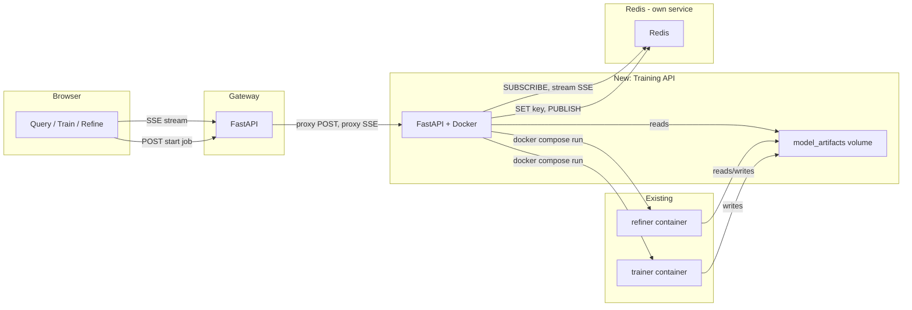

# Train and Refine GUI Pages Plan

## 1. Project Overview

### 1.1 Goal

Add two new frontend "pages" (Train and Refine) to the gateway web UI with
tabulated data, a new backend service (training-api) that triggers the
trainer/refiner via Docker Compose and exposes REST APIs, and Redis for job
state and Pub/Sub so that completion is event-driven (no polling, no long
timeouts, no sleep). The UI subscribes via Server-Sent Events (SSE) and
receives a push when the job completes.

### 1.2 Scope

- **Train page**: Run training from the UI; display metrics and misclassified
  table; event-driven completion via SSE
- **Refine page**: Run refinement from the UI; display report, comparison
  (before/after metrics), tabulated proposed relabels/examples/train candidate;
  Promote button to run promotion; event-driven completion via SSE
- **Training API service**: Canonical Python implementation of train, refine,
  and promote; HTTP API for the UI and CLI entrypoint for scripts
- **Redis**: Own service in the Compose stack; job keys and Pub/Sub for
  event-driven SSE
- **Gateway**: Proxy routes for training-api; streaming proxy for SSE endpoints

### 1.3 Technical Requirements

- **Event-driven**: No polling; job completion notified via Redis PUBLISH and
  SSE stream to client
- **Single implementation**: Train, refine, and promote implemented once in
  Python; triggered by (1) HTTP API (UI) and (2) CLI via Docker Compose (scripts)
- **Platform**: Same stack as main project (Docker Compose, Python/FastAPI)
- **Redis**: Dedicated Redis service in same Compose file; training-api connects
  via REDIS_URL or REDIS_HOST/REDIS_PORT

## 2. Current State

- **Frontend**: Vanilla HTML/CSS/JS in `services/gateway/app/static/` - single
  page, no router; no tables today (only list-based trace timeline)
- **Train/Refine**: One-shot containers run via `docker compose --profile train
  run --rm trainer` and `docker compose --profile refine run --rm refiner`. They
  read/write the **model_artifacts** volume and host-mounted `train.csv`. The
  gateway has **no access** to this volume, so it cannot read `metrics.json`,
  `misclassified.csv`, or refinement outputs
- **Trainer outputs**: `metrics.json` (accuracy, classification_report,
  confusion_matrix), `misclassified.csv` (columns: text, true_label, pred_label,
  pred_confidence, probs_json)
- **Refiner outputs**: `refinement_report.json` (rows_processed, relabels_proposed,
  examples_proposed, rows_skipped, errors), `proposed_relabels.csv`,
  `proposed_examples.csv`, `train_candidate.csv`, `metrics_before.json`.
  Comparison "after" metrics require running the trainer on `train_candidate.csv`
  to produce `metrics_candidate.json` (as in `scripts/promote.sh`)

## 3. System Architecture

### 3.1 Components

1. **Browser UI**: Query | Train | Refine (hash-based routing)
2. **Gateway**: Proxies POST/GET to training-api; streaming proxy for SSE
3. **Training API**: FastAPI service; runs train/refine/promote (Python); Redis
   job state and Pub/Sub; reads/writes model_artifacts volume
4. **Redis**: Dedicated service; job keys (TTL); Pub/Sub channels for completion
5. **Trainer / Refiner**: Existing one-shot containers; invoked by training-api
   via Docker Compose

### 3.2 Architecture Diagram



### 3.3 Event-Driven Flow

- **Purpose**: No polling, no long timeouts, no sleep. Train/refine run as
  background jobs; the API returns `job_id` immediately. When a job completes,
  the backend publishes to Redis; the client is notified via SSE and updates the
  UI once
- **Redis keys**: Per-job state at `job:train:{job_id}` / `job:refine:{job_id}`
  (status, result, error) for persistence and optional GET status; TTL (e.g. 24h)
- **Redis Pub/Sub**: On job completion, training-api PUBLISHes to channel
  `job:train:events:{job_id}` or `job:refine:events:{job_id}` with final payload
  (e.g. `{"status":"completed","result":{...}}` or `{"status":"failed","error":"..."}`)
- **SSE**: Training-api exposes GET `/train/events/{job_id}` and
  GET `/refine/events/{job_id}` as SSE streams. Each endpoint SUBSCRIBEs to the
  Redis channel; on first message, sends it to the client as an SSE event and
  closes the stream. Browser uses `EventSource`; no polling
- **Gateway**: Proxies POST (create job) and streaming proxy for GET
  .../events/{job_id}. Normal timeouts on POST; SSE is long-lived until event
  delivered
- **Frontend**: POST to start job, get `job_id`, open EventSource to
  `/api/train/events/{job_id}` (or refine). Show progress bar. On one SSE event
  (completed/failed), close EventSource, hide progress bar, render result or error

### 3.4 Single Implementation, Multiple Triggers

- **Backend process** (train, refine, promote) is implemented once as **Python
  code** in the training-api service
- **Two triggers**:
  - **Bash script (CLI)**: Uses Docker Compose to run the same Python code
    (e.g. `docker compose run training-api promote`). The script does not contain
    business logic; it only invokes the container
  - **UI**: Calls the training-api HTTP API (e.g. POST `/refine/promote`). The
    route invokes the same Python code
- **No duplication**: One Python codebase; script triggers via Compose, UI
  triggers via HTTP. Bash scripts (e.g. `scripts/promote.sh`) are updated to
  invoke training-api via Docker Compose instead of inlining logic

## 4. Training API Service

### 4.1 Location and Role

- **Location**: New service `services/training-api/`
- **Role**: Holds the canonical Python implementation of train, refine, and
  promote. (1) Exposes HTTP endpoints that call this Python code (used by the UI).
  (2) Exposes a CLI/entrypoint that bash scripts invoke via Docker Compose
  (e.g. `docker compose run training-api promote`). Same code runs in both cases.
  For the UI, the API wraps train/refine in job state and Redis Pub/Sub and reads
  artifacts from the volume

### 4.2 Redis Integration

- Store per-job state at `job:train:{job_id}` / `job:refine:{job_id}` with JSON:
  `{ "status", "result" (when completed), "error" (when failed), "created_at" }`
- TTL (e.g. 24h) on job keys
- On job completion, background task PUBLISHes to channel
  `job:train:events:{job_id}` or `job:refine:events:{job_id}` with same payload
- Redis is its own service in the same Compose stack. Training-api connects via
  Redis service name (e.g. `redis:6379`) or REDIS_URL / REDIS_HOST / REDIS_PORT

### 4.3 Volume and Artifacts

- **Volume layout**: Unchanged. Trainer outputs at `/model/` (same volume as
  refiner's `/data/`); training-api mounts model_artifacts at one path to read
  both. When the background task finishes, it reads artifact files and puts
  parsed result into Redis so status endpoint can return it without re-reading
  the volume
- **Promotion**: Read-write mount of host `train.csv` (e.g.
  `../services/trainer/train.csv:/promote_target/train.csv`) so POST
  /refine/promote can write the promoted dataset

### 4.4 Image Modes

- **HTTP server** (default CMD): Serves FastAPI app for UI
- **CLI mode**: Override for `docker compose run training-api promote` (or
  `train`, `refine` subcommands) so scripts run the same Python code

## 5. Gateway Proxy and Routes

### 5.1 Configuration

- In `services/gateway/app/main.py`: Add configuration for training-api base
  URL (env var, e.g. `TRAINING_API_URL`)
- UI talks only to the gateway; gateway proxies to training-api

### 5.2 Proxy Routes

| Gateway Route | Training-API Target | Notes |
| ---- | ---- | ---- |
| POST /api/train | POST /train | Returns job_id; normal timeout |
| GET /api/train/events/{job_id} | GET /train/events/{job_id} | Streaming proxy (SSE) |
| GET /api/train/status/{job_id} | GET /train/status/{job_id} | Optional |
| GET /api/train/last | GET /train/last | |
| POST /api/refine | POST /refine | Returns job_id |
| GET /api/refine/events/{job_id} | GET /refine/events/{job_id} | Streaming proxy (SSE) |
| GET /api/refine/status/{job_id} | GET /refine/status/{job_id} | |
| GET /api/refine/last | GET /refine/last | |
| POST /api/refine/promote | POST /refine/promote | Longer timeout (e.g. 5 min) |

- **Streaming proxy**: For GET .../events/{job_id}, gateway must stream SSE
  response from training-api to client (EventSource on gateway origin)

## 6. Frontend: Navigation and Pages

### 6.1 Navigation

- Add nav: "Query | Train | Refine" that sets `location.hash` to `#`,
  `#train`, `#refine`
- On load and on `hashchange`, show the corresponding section; hide the others
- Default view remains the existing query form and result section

### 6.2 Train Page (section when `#train`)

- **Run training** button: POST /api/train, get job_id; show progress bar; open
  EventSource to GET /api/train/events/{job_id}. On one SSE event (completed or
  failed), close EventSource, hide progress bar, render result or error
- **Progress bar**: Visible from POST until SSE event received; indeterminate
  (animated)
- **Load last run** (optional): GET /api/train/last if no trigger this session
- **Metrics**: Tabulated format:
  - One row/summary for overall accuracy
  - Table for classification_report: rows = labels, columns = precision, recall,
    f1-score, support (if present)
  - Table for confusion_matrix: rows/columns = labels (from report or fixed order)
- **Misclassified**: Table with columns text, true_label, pred_label,
  pred_confidence, probs_json (or truncated). Use `<table>` with thead/tbody

### 6.3 Refine Page (section when `#refine`)

- **Run refinement** button: POST /api/refine, get job_id; progress bar;
  EventSource to GET /api/refine/events/{job_id}. On one SSE event, close
  EventSource, render results
- **Progress bar**: Visible from POST until SSE event; indeterminate
- **Load last run** (optional): GET /api/refine/last
- **Report**: Summary from report (rows_processed, relabels_proposed,
  examples_proposed, rows_skipped, errors) as small table or definition list
- **Comparison (before vs after)**:
  - Metrics before: Same structure as Train page (accuracy + classification_report
    table + confusion matrix)
  - Metrics after: Same structure
  - Present side-by-side or one table with Before/After columns so user can
    review the decision
- **Promote button**: After reviewing comparison and tabulated data, user clicks
  Promote -> POST /api/refine/promote. Show loading (promotion may take a few
  minutes). On success, display response ("Promoted" with acc_before/acc_after,
  or "Metrics did not improve; candidate discarded"). Optionally remind user to
  restart ai_router if promoted. On error (e.g. train_candidate missing), show
  message
- **Tabulated data**:
  - Proposed relabels: table from proposed_relabels (columns as in CSV)
  - Proposed examples: table from proposed_examples
  - Train candidate: table from train_candidate_sample (or full with pagination
    if large)

### 6.4 Styling and UX

- Reuse existing CSS variables and layout from
  `services/gateway/app/static/styles.css`
- Add table styles (e.g. `.data-table`, borders, alternating rows) and sections
  (`.train-section`, `.refine-section`)
- Progress bar: Indeterminate animation while waiting for completion event
- Disable trigger buttons and show "Running..." while EventSource open or
  promote in flight; handle errors with message area

## 7. Data Shapes and Tables

### 7.1 Metrics (from trainer)

```json
{
  "accuracy": 0.92,
  "classification_report": {
    "<label>": {
      "precision": 0.9,
      "recall": 0.88,
      "f1-score": 0.89,
      "support": 50
    }
  },
  "confusion_matrix": [[...]]
}
```

- Flatten classification_report to rows; confusion_matrix with row/col headers =
  label order

### 7.2 Misclassified

- Array of `{ "text", "true_label", "pred_label", "pred_confidence",
  "probs_json" }`

### 7.3 Refine Response

- **report**: Object (rows_processed, relabels_proposed, examples_proposed,
  rows_skipped, errors)
- **metrics_before**, **metrics_after**: Same shape as metrics above
- **proposed_relabels**, **proposed_examples**, **train_candidate_sample**:
  Arrays of objects; use object keys as table headers

## 8. API Endpoints (Training API)

### 8.1 Train

#### POST /train

- Creates job (generate job_id). Store in Redis with status "pending". Spawn
  background task that runs same Python train logic as CLI; on success read
  artifacts, SET Redis, PUBLISH to job:train:events:{job_id}; on failure SET
  and PUBLISH error. Return immediately `{ "job_id": "..." }`.

#### GET /train/events/{job_id} (SSE)

- Subscribe to Redis channel job:train:events:{job_id}. When first message
  received (completed or failed), send as SSE event to client and close stream

#### GET /train/status/{job_id}

- Read from Redis key. Return `{ "job_id", "status", "result", "error" }`. 404
  if unknown/expired

#### GET /train/last

- Read last run from volume; return same shape. 404 if not present

### 8.2 Refine

#### POST /refine

- Create job; background task runs same Python refine logic as CLI. On
  completion, read artifacts, SET Redis, PUBLISH to job:refine:events:{job_id}.
  Return `{ "job_id": "..." }` immediately

#### GET /refine/events/{job_id} (SSE)

- Subscribe to job:refine:events:{job_id}; on first message, send as SSE and
  close

#### GET /refine/status/{job_id}, GET /refine/last

- Same pattern as train

#### POST /refine/promote (or POST /promote)

- Call same Python promote logic as CLI. Synchronous; longer timeout. Return
  JSON e.g. `{ "promoted": true|false, "message": "...", "acc_before": number,
  "acc_after": number }`. 400 if train_candidate missing; 200 with
  promoted: false if metrics did not improve

## 9. Docker Compose

### 9.1 Single Deployment

- One Compose stack deploys the entire operation (gateway, Redis, training-api,
  ai_router, backends, etc.). No separate installation for Redis

### 9.2 Redis Service

- In `compose/docker-compose.yaml`, define **Redis as a dedicated service**
  (e.g. `redis:` with image `redis:7-alpine`). That service runs only Redis.
  Other services (e.g. training-api) connect via service name (e.g. `redis:6379`)
  or REDIS_URL. Training-api has `depends_on: redis`

### 9.3 Training-API Service

- Add `training-api` with:
  - model_artifacts volume mount (read/write for reading artifacts)
  - Docker socket mount (to run `docker compose` for trainer/refiner)
  - Compose project directory mount (so it can run compose from correct context)
  - REDIS_URL (or REDIS_HOST/REDIS_PORT)
  - Read-write mount for promotion: host `services/trainer/train.csv` at e.g.
    `/promote_target/train.csv`
- Place in appropriate profile (e.g. `ops` or `refine`) so one deployment
  deploys all. Gateway may show "Training API not available" when profile
  inactive
- Default CMD: HTTP server. Override for CLI: e.g. `docker compose run
  training-api promote`

### 9.4 Optional

- Document that for Refine, Ollama must be up (e.g. `docker compose --profile
  refine up -d ollama` first) so the refiner can run

## 10. Security and Robustness

### 10.1 Network and Exposure

- Restrict training-api and Redis to internal network; do not expose Docker
  socket or Redis publicly
- Gateway proxies to training-api on internal network only

### 10.2 Job Execution

- Apply process timeout (e.g. 1h) for background train/refine jobs so a stuck
  run does not leak resources
- Set Redis TTL on job keys to limit storage

### 10.3 Gateway

- Normal proxy timeouts (no long 300s) except for POST /api/refine/promote
  (e.g. 5 min)
- Consider response size limits for status payload when result is large

### 10.4 Validation

- After adding new Python deps (e.g. redis) and Dockerfile, run Snyk or project
  security check per project rules
- Document Redis and training-api in stack; document Promote button and CLI
  trigger

## 11. File Summary

| Area | Files to add/modify |
| ---- | ---- |
| New service | `services/training-api/` (main app, Dockerfile, requirements.txt; canonical Python for train/refine/promote; HTTP server + CLI entrypoint; Redis client, background job runner) |
| Scripts | `scripts/promote.sh` (and any train/refine scripts) updated to trigger via `docker compose run training-api promote` etc. |
| Compose | `compose/docker-compose.yaml` (Redis as own service, training-api, volumes, profiles) |
| Gateway | `services/gateway/app/main.py` (TRAINING_API_URL, proxy routes for train, refine, events, status, refine/promote; streaming proxy for SSE; longer timeout for promote) |
| Frontend | `services/gateway/app/static/index.html` (nav, Train/Refine sections, progress bar, tables, Promote button), `app.js` (hash routing, EventSource, POST /api/refine/promote, result display), `styles.css` (tables, progress bar) |

## 12. Implementation Milestones

### Milestone 1: Training API Skeleton

- [ ] Create `services/training-api/` directory and project structure
- [ ] Add requirements.txt (FastAPI, uvicorn, redis, httpx, etc.)
- [ ] Add Dockerfile (default CMD HTTP server; override for CLI e.g. `docker
  compose run training-api promote`)
- [ ] Add healthcheck and REDIS_URL/REDIS_HOST configuration

### Milestone 2: Canonical Python and Redis

- [ ] Implement canonical Python run_train(), run_refine(), run_promote() (same
  steps as trainer/refiner/promote)
- [ ] Add Redis client and job key/ttl helpers; implement PUBLISH on job
  completion
- [ ] Add CLI entrypoint (e.g. python -m app.cli promote/train/refine) that
  calls same run_* functions

### Milestone 3: Train Endpoints

- [ ] Implement POST /train (job_id, Redis pending, background run_train(), read
  artifacts, SET result, PUBLISH, return job_id)
- [ ] Implement GET /train/events/{job_id} (SSE): SUBSCRIBE to Redis channel,
  stream first message, close
- [ ] Implement GET /train/status/{job_id} and GET /train/last (read from Redis
  or volume)

### Milestone 4: Refine and Promote Endpoints

- [ ] Implement POST /refine (same pattern as train with run_refine(), PUBLISH to
  job:refine:events)
- [ ] Implement GET /refine/events/{job_id}, GET /refine/status/{job_id}, GET
  /refine/last
- [ ] Implement POST /refine/promote: call run_promote(), return JSON (promoted,
  message, acc_before, acc_after)

### Milestone 5: Compose and Gateway

- [ ] Add Redis service to compose/docker-compose.yaml (e.g. redis:7-alpine)
- [ ] Add training-api service (model_artifacts, Docker socket, project dir,
  REDIS_URL, promote_target mount, depends_on redis)
- [ ] Put training-api and Redis in appropriate profile (e.g. ops or refine)
- [ ] Add TRAINING_API_URL env and config in services/gateway/app/main.py
- [ ] Add proxy routes POST/GET /api/train, /api/train/events/{job_id},
  /api/train/status/{job_id}, /api/train/last
- [ ] Add proxy routes POST/GET /api/refine, /api/refine/events/{job_id},
  /api/refine/status/{job_id}, /api/refine/last
- [ ] Add proxy route POST /api/refine/promote with longer timeout (e.g. 5 min)
- [ ] Implement streaming proxy for SSE endpoints (GET .../events/{job_id}) for
  EventSource on gateway

### Milestone 6: Frontend Navigation and Train Page

- [ ] Add navigation (Query | Train | Refine) and hash-based routing (#, #train,
  #refine); show/hide sections on load and hashchange
- [ ] Train page: Run training button, progress bar container, area for
  metrics/misclassified tables
- [ ] Train page: on click POST /api/train, get job_id, show progress bar,
  EventSource /api/train/events/{job_id}; on event render metrics +
  misclassified tables
- [ ] Train page: optional Load last run using GET /api/train/last
- [ ] Add CSS for tables (.data-table), progress bar (indeterminate animation),
  Train section (.train-section)

### Milestone 7: Frontend Refine Page

- [ ] Refine page: Run refinement button, progress bar, areas for report,
  comparison, tabulated data, Promote button
- [ ] Refine page: on click POST /api/refine, EventSource
  /api/refine/events/{job_id}; on event render report, metrics before/after,
  proposed relabels/examples/train_candidate tables
- [ ] Refine page: Promote button; on click POST /api/refine/promote, show
  loading; display result (promoted or not, acc_before/acc_after, restart
  ai_router reminder)
- [ ] Add CSS for Refine section (.refine-section)
- [ ] Disable trigger buttons and show Running... while EventSource open or
  promote in flight; handle errors with message area

### Milestone 8: Scripts and Security

- [ ] Update scripts/promote.sh to trigger via `docker compose run training-api
  promote` instead of inlining logic
- [ ] Add or update train/refine scripts to use `docker compose run
  training-api train` and `training-api refine` if applicable
- [ ] Restrict training-api and Redis to internal network; do not expose Docker
  socket or Redis publicly
- [ ] Apply process timeout for background train/refine jobs; set Redis TTL on job
  keys
- [ ] Run Snyk (or project security check) after adding new deps and Dockerfile
- [ ] Document Redis and training-api in stack; document Promote button and CLI
  trigger; optional note Ollama must be up for Refine

## 13. Definition of Done

The Train and Refine GUI Pages work is complete when:

- [ ] Training-api service runs with HTTP server and CLI entrypoint; same Python
  code used for train, refine, and promote from both UI and scripts
- [ ] Redis is a dedicated service in Compose; training-api uses it for job state
  and Pub/Sub; job completion is event-driven (no polling)
- [ ] POST /train and POST /refine return job_id immediately; GET
  .../events/{job_id} streams one SSE event on completion
- [ ] Gateway proxies all training-api routes and streams SSE for events
  endpoints; POST /api/refine/promote has longer timeout
- [ ] UI has Query | Train | Refine navigation with hash-based routing
- [ ] Train page: Run training, progress bar, EventSource, metrics and
  misclassified tables rendered on completion; optional Load last run
- [ ] Refine page: Run refinement, progress bar, EventSource, report and
  comparison and tabulated data on completion; Promote button with result display
- [ ] scripts/promote.sh invokes training-api via Docker Compose
- [ ] Training-api and Redis are on internal network only; timeouts and TTL
  applied; security check run and documented

## 14. Technical Notes

### 14.1 Promote in Scope

- A **Promote** button on the Refine page runs the promotion process from the UI
  after the user reviews the comparison. Same behind-the-scenes Python code: (1)
  Bash script uses Docker Compose to trigger it (e.g. `docker compose run
  training-api promote`), and (2) UI calls training-api (POST /refine/promote),
  which runs the same Python code. One implementation; two triggers.

### 14.2 Related Documentation

- Trainer/refiner: See PROJECT_PLAN.md Section 2.1 (trainer, refiner), Section 9.3
- Refiner flow and promote: See REFINER_PLAN.md, REFINER_TECHNICAL.md,
  REFINER_FLOW.md in docs/auxiliary/refiner/

## Appendix: Quick Reference

### Start Stack with Training API and Redis

```bash
docker compose -f compose/docker-compose.yaml --profile refine up --build
```

(Use the profile that includes Redis and training-api; adjust name if different.)

### Trigger Promote via CLI

```bash
docker compose run training-api promote
```

### Trigger Train via CLI

```bash
docker compose run training-api train
```

### Trigger Refine via CLI

```bash
docker compose run training-api refine
```

### UI Flow (Train)

1. Open gateway UI, go to Train (#train)
2. Click "Run training" -> POST /api/train -> job_id
3. EventSource /api/train/events/{job_id} -> one SSE event -> render metrics and
   misclassified table

### UI Flow (Refine and Promote)

1. Go to Refine (#refine)
2. Click "Run refinement" -> POST /api/refine -> job_id -> EventSource -> render
   report, comparison, tables
3. Click "Promote" -> POST /api/refine/promote -> show result; optionally
   restart ai_router if promoted
